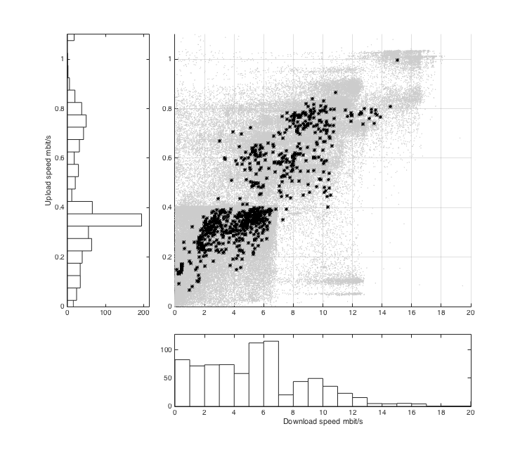

# Discovering users with similar Internet access performance through cluster analysis

Cluster-based system to identify groups of users with a similar Internet access behavior through the analysis of periodic measurements at the end user location.

## Archive main contents

* `RapidMiner\_Unuk.tar.xz` - RapidMiner source files with new Distance Measure F1Max (./src/com/rapidminer/tools/math/similarity/numerical/F1DistanceMax.java)

* `RapidMiner_Unuk_Local_Repository.tar.xz` - RapidMiner project files (.rmp) for 
  1. computing frequency histograms of users' download speed from raw dataset measurements (import\_bin\_csv.rmp),
  2. first-level dbscan clustering for outliers/noise removal (clustering\_dbms.rmp), 
  3. second-level k-means clustering for the identification of goups of homogeneous users (clustering\_kmeans\_remove\_outliers.rmp) 

* `dataset_D1_telecom_20120701_20140630_full.csv.xz` - 
  Dataset D1 listing Neubot measurements of Telecom Italia (AS 3269) users from July 2012 to June 2014 (counting 3659 unique users and 206884 measurements).  

* `dataset_D2_comcast_20120701_20140630_full.csv.xz` - 
  Dataset D2 listing Neubot measurements of Comcast (AS 7922) users from July 2012 to June 2014 (counting 1568 unique users and 778052 measurements).

## Dataset format 

Selected fields of a sample of the Comcast dataset (dataset\_D2\_comcast\_20120701\_20140630\_full.csv) collected by Neubot from July 2012 to June 2014, counting 1568 unique users (uuid) and 778052 measurements (table rows).

| uuid                                   |   subnet_id     |   download_speed (B/s) | 
|----------------------------------------|-----------------|------------------------| 
| "83188da7-d278-46f3-98fc-851991275a2f" | "98.192.0.0/12" | 370928.746597          | 
| "83188da7-d278-46f3-98fc-851991275a2f" | "98.192.0.0/10" | 370928.746597          | 
| "2b37de0c-5f49-4446-8b8f-3b2dad14fb61" | "50.128.0.0/9"  | 3588959.02045          | 
| "e50dda67-7b79-45e4-8629-44e6d94bb076" | "67.160.0.0/11" | 2770919.97139          | 
| "5a6d1b4d-2fcc-4a14-a2ce-0820a37c69c6" | "50.128.0.0/9"  | 5870996.20644          | 
| "37e15aa1-2c8c-430d-8a5d-91b63e920b25" | "174.48.0.0/12" | 1104705.78698          | 
| "e241b273-b42b-4ee9-b6b1-981671caa198" | "107.4.0.0/15"  | 3958999.64622          | 
| "1dc67142-270b-4861-b6c0-81c3c70847e0" | "24.60.0.0/14"  | 1876468.52339          | 
| "901e06dc-5d05-4ff3-b99f-76fc84789c66" | "71.192.0.0/12" | 2768859.27415          | 
| "37e15aa1-2c8c-430d-8a5d-91b63e920b25" | "174.48.0.0/12" | 1576597.18837          | 

**uuid (string)**
  Random unique identifier of the Neubot instance, 
  useful to track successive measurements of the same Neubot user.

**subnet_id (string)**
  Uniquely identifies different types of networks (i.e., subnets) of the same ISP
  (e.g., office or home network, wired or wireless network), that might
  have strongly different performance
  
**download_speed (float)**
  Download speed measured by dividing the number of received bytes by
  the elapsed download time, measured in bytes per second.
  
**asnum (integer)**
  Autonomous System Number (not shown in the table because the same for each row), 
  uniquely identifies each network 
  (i.e. Internet Service Provider or Large Organization) on the Internet. 
  
  
## Sample plots

### Download vs Upload speed AS3269
Scatter plot of download speed versus upload speed of AS3269 user (in `dataset_D1_telecom_20120701_20140630_full.csv.xz`) both for single measurements (green points) and for the computed user average value (black, larger, points).

  
  

